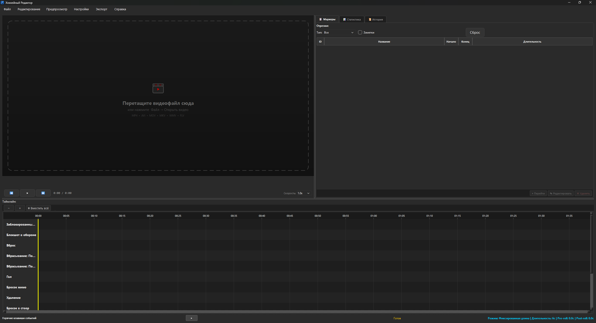
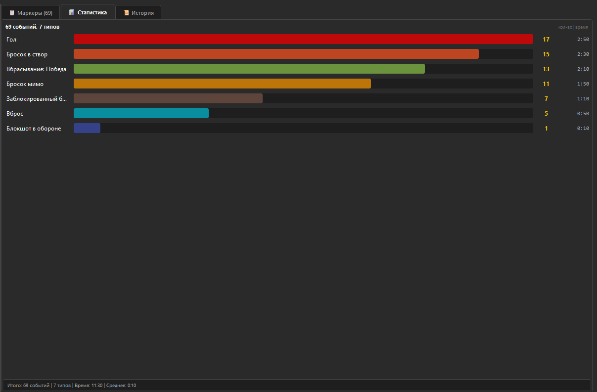
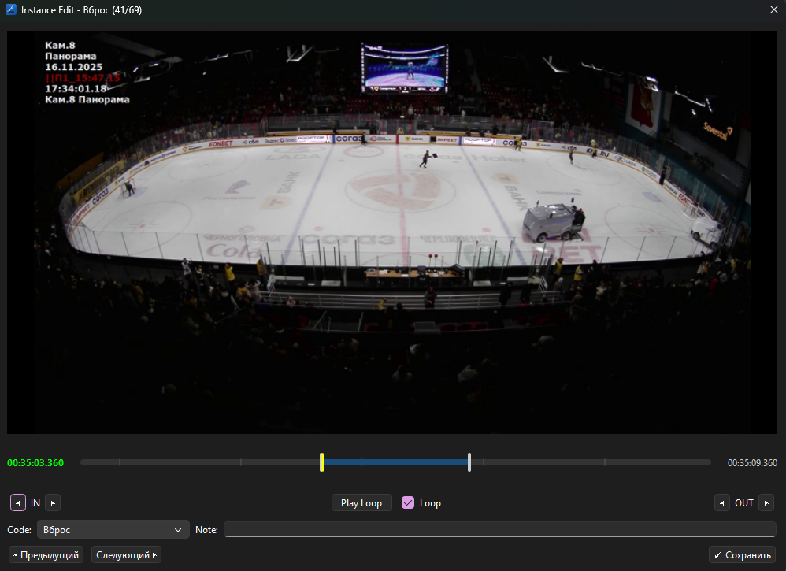
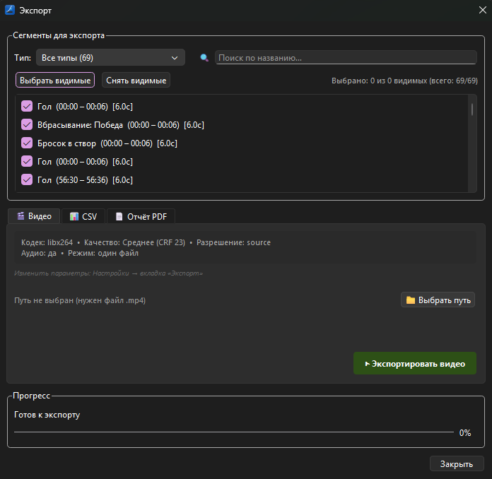

# 🏒 Hockey Editor Pro

**Профессиональный видеоредактор для покадрового анализа хоккейных матчей**

*Frame-by-frame video analysis tool for hockey games*

---

---

# 🇷🇺 Русский

## 📖 Описание

**Hockey Editor Pro** — десктопное приложение для покадрового анализа хоккейных матчей. Позволяет размечать видеозаписи игр, отмечая ключевые игровые события (голы, броски, вбрасывания, входы в зону и др.) с точностью до кадра.

Разработан для тренеров, аналитиков и скаутов, которым нужен быстрый и удобный инструмент для разбора игровых моментов.

### ✨ Основные возможности

#### 🎬 Работа с видео
- Поддержка форматов: **MP4, AVI, MOV, MKV, WMV, FLV**
- Покадровая навигация с помощью горячих клавиш
- Перемотка на ±5 секунд
- Регулировка скорости воспроизведения
- Drag & Drop — перетащите видео в окно

#### 🏷️ Система событий
- **13 предустановленных типов** хоккейных событий:

| Событие | Клавиша | Цвет |
|---------|:-------:|------|
| Гол | `G` | 🔴 |
| Бросок в створ | `H` | 🟠 |
| Бросок мимо | `M` | 🟡 |
| Заблокированный бросок | `B` | 🟤 |
| Вход в зону | `Z` | 🔵 |
| Выход из зоны | `X` | 🔵 |
| Вброс | `D` | 🔵 |
| Потеря | `T` | ⚪ |
| Перехват | `A` | 🟢 |
| Вбрасывание: Победа | `F` | 🟢 |
| Вбрасывание: Поражение | `L` | 🟢 |
| Блокшот в обороне | `K` | 🟣 |
| Удаление | `P` | 🟣 |

- **Пользовательские типы** — создавайте собственные категории событий
- Назначение горячих клавиш для каждого типа

#### ⏱️ Режимы записи
- **Фиксированная длина** — задайте длительность сегмента (по умолчанию 6 сек)
- **Динамический режим** — нажмите клавишу для начала, повторно для завершения
- Настраиваемые **Pre-roll** и **Post-roll** отступы

#### 📊 Аналитика
- **Статистика по типам** — количество, общее время, среднее время
- Визуальные полоски с цветовой кодировкой
- Фильтрация по типу события и наличию заметок

#### 🎯 Таймлайн
- Многодорожечный таймлайн с раздельными треками для каждого типа
- **Масштабирование** — от отдельных кадров до 2+ часов целиком
- Кнопка «⊞ Вместить всё» — уместить запись в ширину экрана
- Контекстное меню: редактировать, удалить, дублировать, экспортировать
- Цветная линейка времени (MM:SS / H:MM:SS)

#### ✏️ Редактор сегментов
- Покадровая подгонка точек входа/выхода (In/Out)
- Предпросмотр с зацикливанием
- Смена типа события, добавление заметок
- Навигация между сегментами ◀ ▶

#### 📤 Экспорт
- **Видео** — отдельные клипы или объединённый файл (H.264 / H.265)
- **CSV** — таблица сегментов для Excel / Google Sheets
- **PDF / HTML** — отчёт со статистикой
- Фильтрация сегментов перед экспортом
- Настраиваемое качество, разрешение, аудио

#### 💾 Проекты
- Сохранение / загрузка проектов (формат `.hep`)
- **Автосохранение** с настраиваемым интервалом
- Полная система **Undo / Redo** (Ctrl+Z / Ctrl+Y)
- Панель истории команд с навигацией кликом

#### 🎨 Интерфейс
- Тёмная тема
- Загрузочный экран (splash screen)
- Toast-уведомления
- Запоминание размеров и положения окна
- Полная **русская локализация**

---

### 🖥️ Системные требования

| Параметр | Минимум | Рекомендуется |
|----------|---------|---------------|
| ОС | Windows 10 | Windows 10/11 |
| Python | 3.10+ | 3.11+ |
| ОЗУ | 4 ГБ | 8+ ГБ |
| FFmpeg | Требуется для экспорта | — |
| Диск | 500 МБ | 1+ ГБ |

---

### 🚀 Установка и запуск

#### Вариант 1: Установщик (рекомендуется)

1. Скачайте `HockeyEditorSetup_1.0.0.exe` со страницы [Releases](https://github.com/mijeha4/hockey_editor/releases)
2. Запустите установщик
3. Готово — ярлык появится на рабочем столе

### 📦 Зависимости

PySide6>=6.6.0          # Графический интерфейс (Qt 6)
opencv-python>=4.8.0    # Обработка видео
numpy>=1.24.0           # Массивы данных
pyinstaller>=6.0.0      # Сборка EXE (опционально)
Внешние программы:

FFmpeg — для экспорта видео (должен быть в PATH)
Inno Setup — для создания установщика (опционально)

### ⌨️ Горячие клавиши
Действие	Клавиша
Воспроизведение / Пауза	Пробел
Отменить	Ctrl+Z
Повторить	Ctrl+Y
Перемотка −5 сек	←
Перемотка +5 сек	→
Новый проект	Ctrl+N
Открыть проект	Ctrl+O
Сохранить проект	Ctrl+S
Экспорт	Ctrl+E
Предпросмотр	Ctrl+P
Настройки	Ctrl+,
Масштаб таймлайна	Ctrl+Колесо
Событие	Назначенная клавиша (G, H, M, B...)

### 🏗️ Архитектура
Проект построен по паттерну MVC (Model–View–Controller):
hockey_editor/
├── main.py                          # Точка входа + Splash Screen
├── config.json                      # Конфигурация по умолчанию
├── hockey_editor.spec               # PyInstaller spec
├── build.bat                        # Скрипт сборки
├── installer.iss                    # Inno Setup скрипт
│
├── assets/
│   ├── icons/                       # Иконки приложения
│   └── styles/                      # QSS стили
│
├── scripts/
│   └── generate_assets.py           # Генератор иконок
│
└── src/
    ├── controllers/                 # Контроллеры
    │   ├── main_controller.py       #   Главный контроллер окна
    │   ├── application_controller.py#   Управление окнами
    │   ├── playback_controller.py   #   Воспроизведение видео
    │   ├── timeline_controller.py   #   Таймлайн + маркеры + undo
    │   ├── project_controller.py    #   CRUD проектов
    │   ├── settings_controller.py   #   Настройки
    │   ├── filter_controller.py     #   Фильтрация маркеров
    │   ├── shortcut_controller.py   #   Горячие клавиши
    │   ├── instance_edit_controller.py  # Редактор сегмента
    │   ├── custom_event_controller.py   # Типы событий
    │   ├── preview_controller.py    #   Предпросмотр
    │   └── export/
    │       └── export_controller.py #   Экспорт видео/CSV/PDF
    │
    ├── models/
    │   ├── config/
    │   │   └── app_settings.py      #   Настройки приложения
    │   ├── domain/
    │   │   ├── marker.py            #   Маркер (сегмент)
    │   │   ├── event_type.py        #   Тип события
    │   │   └── project.py           #   Проект (с сигналами Qt)
    │   └── ui/
    │       └── event_list_model.py  #   Модель для списка событий
    │
    ├── services/
    │   ├── autosave/
    │   │   └── autosave_service.py  #   Авто-сохранение
    │   ├── events/
    │   │   ├── custom_event_manager.py  # Менеджер типов событий
    │   │   └── custom_event_type.py #   Тип события (dataclass)
    │   ├── export/
    │   │   ├── video_exporter.py    #   Экспорт видео (FFmpeg)
    │   │   └── report_exporter.py   #   Экспорт CSV / PDF / HTML
    │   ├── history/
    │   │   ├── history_manager.py   #   Undo / Redo стек
    │   │   └── command_interface.py #   Command pattern
    │   ├── serialization/
    │   │   ├── project_io.py        #   Чтение / запись .hep
    │   │   └── settings_manager.py  #   Persistence настроек
    │   └── video_engine/
    │       └── cv2_wrapper.py       #   OpenCV обёртка
    │
    ├── utils/
    │   ├── shortcut_manager.py      #   Утилиты горячих клавиш
    │   └── time_utils.py            #   Конвертация кадры ↔ время
    │
    └── views/
        ├── splash_screen.py         #   Загрузочный экран
        ├── styles.py                #   Тёмная тема
        ├── dialogs/
        │   ├── custom_event_dialog.py   # Диалог типа события
        │   ├── new_project_dialog.py    # Новый проект
        │   ├── save_changes_dialog.py   # Сохранить изменения?
        │   └── settings_dialog.py       # Настройки (диалог)
        ├── widgets/
        │   ├── drawing_overlay.py       # Оверлей рисования
        │   ├── event_card_delegate.py   # Делегат карточек событий
        │   ├── event_shortcut_list_widget.py  # Панель быстрых кнопок
        │   ├── history_panel.py         # Панель истории undo/redo
        │   ├── marker_segment_timeline.py  # Мини-таймлайн сегмента
        │   ├── player_controls.py       # Кнопки управления плеером
        │   ├── scalable_video_label.py  # Масштабируемый видео-виджет
        │   ├── segment_list.py          # Список сегментов
        │   ├── stats_widget.py          # Панель статистики
        │   ├── timeline.py              # Основной таймлайн
        │   ├── timeline_scene.py        # QGraphicsScene таймлайна
        │   ├── toast_notification.py    # Toast-уведомления
        │   └── video_progress_bar.py    # YouTube-style progress bar
        └── windows/
            ├── export_dialog.py         # Окно экспорта
            ├── instance_edit.py         # Редактор сегмента
            ├── main_window.py           # Главное окно
            ├── preview_window.py        # Предпросмотр
            └── settings_dialog.py       # Настройки (окно)

### 📸 Скриншоты
Добавьте скриншоты в папку docs/screenshots/ и раскомментируйте:

<!-- 
 
🖼️ Главное окно
  
 
 
📊 Статистика
  
 
 
✏️ Редактор сегмента
  
 
 
📤 Экспорт
  
 -->
### 🛠️ Сборка
EXE (портативный)

# Генерация иконок + сборка
build.bat
Результат: dist/HockeyEditor/HockeyEditor.exe

Установщик Windows
Установите Inno Setup
Сначала соберите EXE (build.bat)
Откройте installer.iss в Inno Setup Compiler
Нажмите Compile (Ctrl+F9)
Результат: installer_output/HockeyEditorSetup_1.0.0.exe

### 📝 Формат проекта (.hep)
Файл проекта — JSON с расширением .hep:
JSON

{
  "name": "Матч ЦСКА - Динамо",
  "video_path": "C:/Videos/game.mp4",
  "fps": 30.0,
  "version": "1.0",
  "created_at": "2024-01-15T10:30:00",
  "modified_at": "2024-01-15T12:45:00",
  "markers": [
    {
      "id": 1,
      "start_frame": 1500,
      "end_frame": 1680,
      "event_name": "Goal",
      "note": "Гол Овечкина с пятака"
    }
  ]
}
