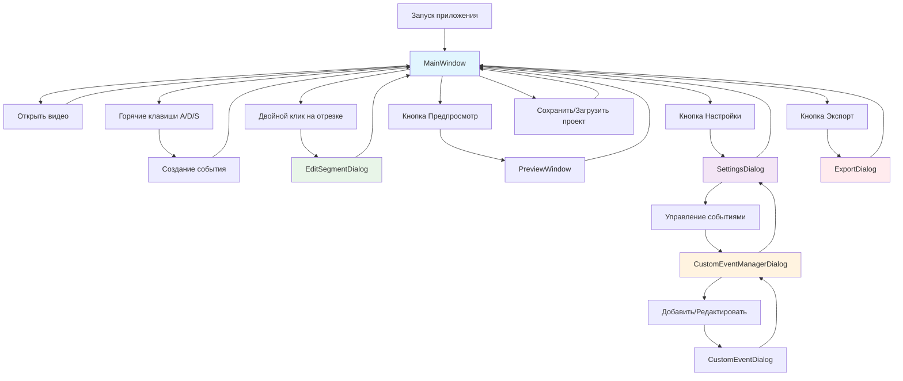

# Граф диалога Hockey Editor

## Обзор

Hockey Editor - профессиональное приложение для анализа хоккейных матчей с возможностью создания временных отрезков событий (атака, защита, смена) с помощью горячих клавиш. Приложение построено на PySide6 (Qt6) и предоставляет интуитивный интерфейс для быстрого анализа спортивных видео.

## Структура диалогов

### Основная архитектура

```
┌─────────────────┐
│   Запуск        │
│   приложения    │
└─────────┬───────┘
          │
          ▼
┌─────────────────┐     ┌─────────────────┐
│  MainWindow     │◄────┤  Открыть видео  │
│  (главное окно) │     │  (Ctrl+O)       │
└─────────┬───────┘     └─────────────────┘
          │
          ├─────────────────┬─────────────────┬─────────────────┐
          │                 │                 │                 │
          ▼                 ▼                 ▼                 ▼
┌─────────────────┐ ┌─────────────────┐ ┌─────────────────┐ ┌─────────────────┐
│ Создание события│ │ Редактирование  │ │ Предпросмотр    │ │ Экспорт видео   │
│ (горячие клавиши│ │ отрезка         │ │ отрезков        │ │ (Ctrl+E)        │
│ A/D/S)          │ │ (двойной клик)  │ │ (👁️)           │ │                 │
└─────────┬───────┘ └─────────┬───────┘ └─────────┬───────┘ └─────────┬───────┘
          │                   │                   │                   │
          └───────────────────┼───────────────────┼───────────────────┘
                              │                   │
                              ▼                   ▼
                    ┌─────────────────┐ ┌─────────────────┐
                    │   Настройки     │ │ Управление      │
                    │   (Ctrl+,)      │ │ событиями       │
                    └─────────┬───────┘ └─────────┬───────┘
                              │                   │
                              ├───────────────────┤
                              │                   │
                              ▼                   ▼
                    ┌─────────────────┐ ┌─────────────────┐
                    │ Добавление/     │ │ Сохранение/     │
                    │ редактирование  │ │ загрузка        │
                    │ события         │ │ проекта         │
                    └─────────────────┘ └─────────────────┘
```

## Детальное описание диалогов

### 1. MainWindow (Главное окно)

**Файл:** `hockey_editor/ui/main_window.py`

**Назначение:** Центральный интерфейс приложения, объединяющий все основные функции.

#### Основные элементы интерфейса:

**Верхняя часть:**
- **Видео плеер** - область воспроизведения с черным фоном
- **Элементы управления видео:**
  - Кнопки Play/Pause, перемотка на 5 сек/кадр
  - Ползунок прогресса с возможностью перемотки
  - Выбор скорости воспроизведения (0.25x - 4.0x)
  - Кнопка полноэкранного режима (заглушка)

**Таймлайн:**
- 3 цветные дорожки: Красная (Атака), Синяя (Защита), Зеленая (Смена)
- Белые полоски отрезков с возможностью масштабирования
- Желтый playhead (текущее время)
- Жёлто-оранжевая полоска активной записи

**Список отрезков (справа):**
- Фильтры: по типу события, по наличию заметок
- Двойной клик → редактирование отрезка
- Кнопки: редактировать, удалить, перейти к времени

**Панель событий:**
- Кнопки A/D/S с подсветкой при активной записи
- Кнопки Undo/Redo (↶ ↷)
- Кнопка предпросмотра (👁️)
- Кнопка настроек (⚙️)
- Кнопка экспорта (💾)

**Статус-бар:**
- Текущее время / общее время
- Количество отрезков
- FPS, скорость воспроизведения
- Статус записи ("🔴 Recording: Attack")

#### Переходы и взаимодействия:

| Действие | Переход | Диалог/Функция |
|----------|---------|----------------|
| Ctrl+O | → | Открыть видео (QFileDialog) |
| A/D/S/Custom | → | Создание события (EventCreationController) |
| Двойной клик на отрезке | → | EditSegmentDialog |
| Кнопка 👁️ | → | PreviewWindow |
| Кнопка ⚙️ | → | SettingsDialog |
| Кнопка 💾 | → | ExportDialog |
| Ctrl+S | → | Сохранить проект |
| Ctrl+O (повторно) | → | Загрузить проект |

#### Горячие клавиши:

| Клавиша | Действие |
|---------|----------|
| A/D/S | Создание события |
| Space | Play/Pause |
| Ctrl+O | Открыть видео |
| Ctrl+S | Сохранить проект |
| Ctrl+E | Экспорт |
| Ctrl+Z | Undo |
| Ctrl+Shift+Z | Redo |
| Left/Right | Перемотка ±5 сек |
| Esc | Отмена записи |

---

### 2. SettingsDialog (Диалог настроек)

**Файл:** `hockey_editor/ui/settings_dialog.py`

**Назначение:** Централизованное управление настройками приложения.

#### Вкладки:

**1. Режим записи:**
- **Режим расстановки:** Динамический (2 нажатия) / Фиксированная длина (1 нажатие)
- **Фиксированная длительность:** 1-120 секунд
- **Pre-roll:** 0-10 секунд (откат назад от начала)
- **Post-roll:** 0-10 секунд (добавление в конец)

**2. Горячие клавиши:**
- Информация о системе горячих клавиш
- Управление через диалог "Управление событиями"

**3. Автосохранение:**
- Включение/отключение автосохранения
- Интервал: 1-60 минут

#### Переходы:

- **Кнопка "Управление событиями"** → CustomEventManagerDialog

---

### 3. CustomEventManagerDialog (Управление событиями)

**Файл:** `hockey_editor/ui/custom_event_dialog.py`

**Назначение:** Управление пользовательскими типами событий.

#### Функции:

- **Список событий:** с цветными иконками, горячими клавишами, описаниями
- **Добавить событие** → CustomEventDialog
- **Редактировать событие** → CustomEventDialog
- **Удалить событие** (только пользовательские)
- **Сброс к настройкам по умолчанию**

#### Переходы:

- **Добавить/Редактировать** → CustomEventDialog

---

### 4. CustomEventDialog (Добавление/редактирование события)

**Файл:** `hockey_editor/ui/custom_event_dialog.py`

**Назначение:** Создание или изменение типа события.

#### Поля формы:

- **Название события** (обязательно)
- **Описание** (опционально)
- **Горячая клавиша** (опционально)
- **Цвет** (выбор цвета с превью)

#### Валидация:

- Название не может быть пустым
- Проверка уникальности названия
- Валидация формата горячей клавиши

---

### 5. EditSegmentDialog (Редактирование отрезка)

**Файл:** `hockey_editor/ui/edit_segment_dialog.py`

**Назначение:** Точная настройка параметров отрезка.

#### Поля формы:

- **Тип события** (выпадающий список всех доступных событий)
- **Время начала** (MM:SS)
- **Время конца** (MM:SS)
- **Длительность** (MM:SS, рассчитывается автоматически)
- **Примечание** (текстовое поле)

#### Элементы управления временем:

- **Кнопки ±1:** сдвиг на 1 кадр (Shift+клик = 10 кадров)
- **Кнопка ⚓:** взять время из текущего положения плеера
- **Валидация:** начало < конец, визуальная индикация ошибок

#### Особенности:

- Автоматический расчет длительности
- Перемотка видео при изменении времени
- Визуальная валидация (красная подсветка при ошибках)

---

### 6. ExportDialog (Экспорт видео)

**Файл:** `hockey_editor/ui/export_dialog.py`

**Назначение:** Экспорт выделенных отрезков в видео файл.

#### Секции:

**Выбор сегментов:**
- Чекбоксы для каждого отрезка
- Кнопки "Select All" / "Deselect All"
- Отображение: №, тип, время, длительность

**Настройки видео:**
- **Кодек:** h264, h265, mpeg4, copy
- **Разрешение:** Source, 4K, 1080p, 720p, 480p, 360p
- **Качество:** High/Medium/Low/Custom (CRF 18/23/28)
- **Формат:** MP4, MOV, MKV, WebM

**Опции:**
- **Include Audio** (включить аудио)
- **Merge Segments** (объединить в один файл)

**Прогресс:**
- Прогресс-бар экспорта
- Статус: "Exporting... X%"
- Асинхронная обработка в отдельном потоке

---

### 7. PreviewWindow (Предпросмотр)

**Файл:** `hockey_editor/ui/preview_window.py`

**Назначение:** Просмотр и фильтрация созданных отрезков.

#### Функции:

- Просмотр всех отрезков в списке
- Фильтрация по типам событий
- Переход к конкретному времени
- Возможность редактирования отрезков

---

## Mermaid диаграмма графа диалога



## Пользовательские сценарии

### Сценарий 1: Быстрый анализ матча

1. **Запуск** → MainWindow открывается
2. **Открыть видео** → QFileDialog → загрузка видео
3. **Создание отрезков:**
   - Нажать **A** → начало атаки
   - Видео продолжает воспроизведение
   - Нажать **A** → конец атаки
   - Повторить для D/S
4. **Просмотр результатов** на таймлайне
5. **Экспорт** → ExportDialog → выбор параметров → экспорт

### Сценарий 2: Настройка под конкретный вид спорта

1. **Настройки** → SettingsDialog
2. **Управление событиями** → CustomEventManagerDialog
3. **Добавить событие** → CustomEventDialog:
   - Название: "Гол"
   - Клавиша: "G"
   - Цвет: красный
4. **Сохранение настроек**
5. Использование новой горячей клавиши **G**

### Сценарий 3: Точная корректировка анализа

1. **Двойной клик** на отрезке → EditSegmentDialog
2. **Корректировка времени:**
   - Кнопки ±1 для точной настройки
   - Кнопка ⚓ для взятия времени из плеера
3. **Изменение типа события** в выпадающем списке
4. **Добавление примечания**
5. **Сохранение** изменений

### Сценарий 4: Массовый экспорт

1. **Экспорт** → ExportDialog
2. **Выбор сегментов** (Select All или выборочно)
3. **Настройка качества:**
   - Кодек: h264
   - Разрешение: 1080p
   - Качество: Medium
4. **Опции:** Include Audio, Merge Segments
5. **Запуск экспорта** → отслеживание прогресса

## Технические особенности

### State Machine создания событий

```
IDLE → RECORDING (первое нажатие A/D/S)
RECORDING → RECORDED (второе нажатие)
RECORDED → IDLE (автоматически через 500мс)
```

### Система фильтров

- **По типу события:** выпадающий список со всеми доступными событиями
- **По заметкам:** чекбокс "Показывать только с заметками"
- **Применение:** в реальном времени обновляет список отрезков

### Автосохранение

- **Интервал:** настраивается 1-60 минут
- **Формат:** JSON файл с маркерами
- **Восстановление:** при следующем запуске

### Undo/Redo система

- **Хранение операций:** стек команд AddMarkerCommand, DeleteMarkerCommand
- **Горячие клавиши:** Ctrl+Z / Ctrl+Shift+Z
- **Интеграция:** с таймлайном и списком отрезков

## Заключение

Граф диалога Hockey Editor представляет собой иерархическую структуру с центральным MainWindow, от которого расходятся специализированные диалоги для различных функций. Такая архитектура обеспечивает интуитивное использование приложения для анализа спортивных видео с возможностью глубокой настройки под конкретные нужды пользователя.
