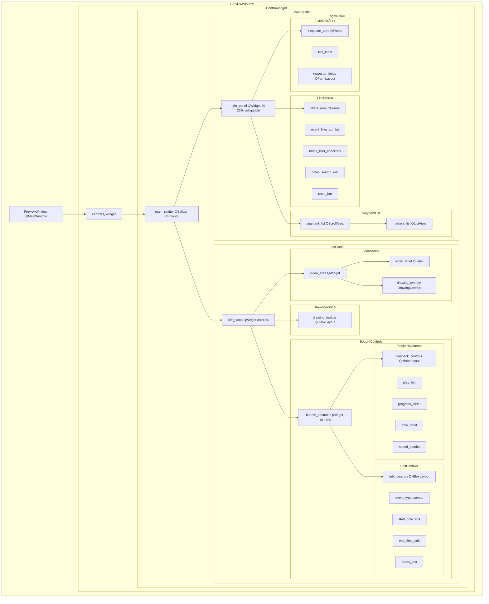

# План редизайна layout окна Preview-Segments

## Обзор

Документ описывает новую структуру layout для окна Preview-Segments в проекте hockey_editor, чтобы достичь профессионального вида, похожего на Hudl/Sportscode/LongoMatch.

## Текущая структура (проблемы)

```
PreviewWindow (QMainWindow)
└── central (QWidget)
    └── main_layout (QHBoxLayout, 7:3)
        ├── video_layout (QVBoxLayout, 70%)
        │   ├── video_container (QWidget)
        │   │   ├── video_label (QLabel)
        │   │   └── drawing_overlay (DrawingOverlay)
        │   ├── drawing_toolbar (QHBoxLayout)
        │   └── controls_layout (QHBoxLayout)
        │       ├── play_btn
        │       ├── progress_slider
        │       ├── time_label
        │       └── speed_combo
        └── right_splitter (QSplitter, Vertical, 30%)
            ├── top_widget (QWidget)
            │   ├── filters (QVBoxLayout)
            │   └── markers_list (QListView)
            └── inspector_widget (QWidget)
                └── inspector fields
```

**Проблемы:**
- Видео имеет большие черные отступы (aspect ratio не оптимизирован)
- Список сегментов cramped (узкий)
- Нижняя панель слишком высокая
- Нет режима презентации
- Правая панель не collapsible

---

## Новая структура layout

### Диаграмма (Mermaid)



### Иерархия виджетов (ASCII)

```
PreviewWindow (QMainWindow)
└── central (QWidget)
    └── main_splitter (QSplitter, Horizontal)
        ├── left_panel (QWidget, stretch factor 4-5, 80-90%)
        │   ├── video_area (QWidget, Expanding)
        │   │   ├── video_label (QLabel, centered, aspect ratio)
        │   │   └── drawing_overlay (DrawingOverlay, same geometry)
        │   ├── drawing_toolbar (QHBoxLayout, compact)
        │   └── bottom_controls (QWidget, fixed height 60-80px)
        │       ├── playback_controls (QHBoxLayout)
        │       │   ├── play_btn (QPushButton)
        │       │   ├── progress_slider (QSlider)
        │       │   ├── time_label (QLabel, monospace)
        │       │   └── speed_combo (QComboBox)
        │       └── edit_controls (QHBoxLayout, collapsible)
        │           ├── event_type_combo (QComboBox)
        │           ├── start_time_edit (QLineEdit)
        │           ├── end_time_edit (QLineEdit)
        │           └── notes_edit (QTextEdit, compact)
        └── right_panel (QWidget, stretch factor 1, 20-25%, collapsible)
            ├── filters_area (QFrame, compact)
            │   ├── event_filter_combo (QComboBox)
            │   ├── notes_filter_checkbox (QCheckBox)
            │   ├── notes_search_edit (QLineEdit)
            │   └── reset_btn (QPushButton)
            ├── segment_list (QScrollArea, Expanding)
            │   └── markers_list (QListView)
            └── inspector_area (QFrame, compact)
                ├── title_label (QLabel)
                └── inspector_fields (QFormLayout)
```

---

## Изменения в методе _setup_ui()

### Текущий код (строки 230-352)

```python
def _setup_ui(self):
    """Создать интерфейс."""
    central = QWidget()
    self.setCentralWidget(central)

    main_layout = QHBoxLayout()
    main_layout.setContentsMargins(10, 10, 10, 10)
    main_layout.setSpacing(10)

    # ===== ЛЕВАЯ ЧАСТЬ: ВИДЕОПЛЕЕР (70%) =====
    video_layout = QVBoxLayout()

    # Контейнер для видео с наложением рисования
    self.video_container = QWidget()
    self.video_container.setSizePolicy(QSizePolicy.Expanding, QSizePolicy.Expanding)
    self.video_container.setMinimumSize(1, 1)
    self.video_container.setStyleSheet("background-color: black; border: 1px solid #555555;")

    # Видео
    self.video_label = QLabel(self.video_container)
    self.video_label.setGeometry(0, 0, 800, 450)
    self.video_label.setAlignment(Qt.AlignmentFlag.AlignCenter)
    self.video_label.setToolTip("Preview video player")

    # Виджет для рисования поверх видео
    self.drawing_overlay = DrawingOverlay(self.video_container)
    self.drawing_overlay.setGeometry(0, 0, 800, 450)

    video_layout.addWidget(self.video_container)

    # Панель инструментов рисования
    self._setup_drawing_toolbar(video_layout)

    # Контролы видео
    controls_layout = QHBoxLayout()

    self.play_btn = QPushButton("▶ Play")
    self.play_btn.setMaximumWidth(80)
    self.play_btn.setToolTip("Play/Pause preview (Space)")
    self.play_btn.clicked.connect(self._on_play_pause_clicked)
    controls_layout.addWidget(self.play_btn)

    # Ползунок
    self.progress_slider = QSlider(Qt.Orientation.Horizontal)
    self.progress_slider.setToolTip("Seek within current segment")
    self.progress_slider.sliderMoved.connect(self._on_slider_moved)
    controls_layout.addWidget(self.progress_slider)

    # Время
    self.time_label = QLabel("00:00 / 00:00")
    self.time_label.setMaximumWidth(120)
    self.time_label.setToolTip("Current time / Segment duration")
    controls_layout.addWidget(self.time_label)

    # Скорость
    speed_label = QLabel("Speed:")
    controls_layout.addWidget(speed_label)
    self.speed_combo = QComboBox()
    self.speed_combo.addItems(["0.25x", "0.5x", "0.75x", "1.0x", "1.25x", "1.5x", "2.0x", "3.0x", "4.0x"])
    self.speed_combo.setCurrentText("1.0x")
    self.speed_combo.setMaximumWidth(80)
    self.speed_combo.setToolTip("Playback speed")
    self.speed_combo.currentTextChanged.connect(self._on_speed_changed)
    controls_layout.addWidget(self.speed_combo)

    controls_layout.addStretch()
    video_layout.addLayout(controls_layout)

    main_layout.addLayout(video_layout, 7)

    # ===== ПРАВАЯ ЧАСТЬ: СПИСОК ОТРЕЗКОВ (30%) =====
    right_splitter = QSplitter(Qt.Orientation.Vertical)

    # Верхняя часть: список отрезков
    top_widget = QWidget()
    top_layout = QVBoxLayout(top_widget)
    top_layout.setContentsMargins(0, 0, 0, 0)

    # ===== КОМПАКТНЫЕ ФИЛЬТРЫ =====
    self._setup_filters(top_layout)

    # Список карточек событий
    self.markers_list = QListView()
    self.markers_list.setModel(self.markers_model)
    self.markers_list.setItemDelegate(self.markers_delegate)
    self.markers_list.setStyleSheet(...)
    self.markers_list.setFocusPolicy(Qt.FocusPolicy.NoFocus)
    self.markers_list.setSpacing(2)
    self.markers_list.setUniformItemSizes(True)

    # Подключить сигналы для инспектора
    self.markers_list.selectionModel().currentChanged.connect(self._on_marker_selection_changed)

    top_layout.addWidget(self.markers_list)

    right_splitter.addWidget(top_widget)

    # Нижняя часть: инспектор
    self._setup_inspector(right_splitter)

    # Установить пропорции (70% список, 30% инспектор)
    right_splitter.setSizes([400, 200])

    # Добавить горячие клавиши для редактирования маркеров
    self._setup_marker_editing_shortcuts()

    main_layout.addWidget(right_splitter, 3)

    central.setLayout(main_layout)
```

### Новый код (предлагаемый)

```python
def _setup_ui(self):
    """Создать интерфейс с профессиональным layout."""
    central = QWidget()
    self.setCentralWidget(central)

    # Основной layout - вертикальный для поддержки bottom_controls
    main_layout = QVBoxLayout(central)
    main_layout.setContentsMargins(0, 0, 0, 0)
    main_layout.setSpacing(0)

    # ===== ГОРИЗОНТАЛЬНЫЙ СПЛИТТЕР =====
    self.main_splitter = QSplitter(Qt.Orientation.Horizontal)
    self.main_splitter.setHandleWidth(4)
    self.main_splitter.setChildrenCollapsible(False)

    # ===== ЛЕВАЯ ПАНЕЛЬ: ВИДЕО + КОНТРОЛЫ (80-90%) =====
    self.left_panel = QWidget()
    left_layout = QVBoxLayout(self.left_panel)
    left_layout.setContentsMargins(0, 0, 0, 0)
    left_layout.setSpacing(0)

    # 1. Видео область (Expanding)
    self.video_area = QWidget()
    self.video_area.setSizePolicy(QSizePolicy.Expanding, QSizePolicy.Expanding)
    self.video_area.setStyleSheet("background-color: #000000;")
    
    video_area_layout = QVBoxLayout(self.video_area)
    video_area_layout.setContentsMargins(0, 0, 0, 0)
    
    # Контейнер для видео с наложением рисования
    self.video_container = QWidget()
    self.video_container.setSizePolicy(QSizePolicy.Expanding, QSizePolicy.Expanding)
    self.video_container.setStyleSheet("background-color: #000000;")

    # Видео
    self.video_label = QLabel(self.video_container)
    self.video_label.setAlignment(Qt.AlignmentFlag.AlignCenter)
    self.video_label.setSizePolicy(QSizePolicy.Ignored, QSizePolicy.Ignored)
    self.video_label.setToolTip("Preview video player")

    # Виджет для рисования поверх видео
    self.drawing_overlay = DrawingOverlay(self.video_container)
    
    video_area_layout.addWidget(self.video_container)
    self.video_area.setLayout(video_area_layout)

    left_layout.addWidget(self.video_area, stretch=4)

    # 2. Панель инструментов рисования (compact)
    self._setup_drawing_toolbar(left_layout)

    # 3. Нижние контролы (fixed height)
    self.bottom_controls = QWidget()
    self.bottom_controls.setMaximumHeight(80)
    self.bottom_controls.setMinimumHeight(60)
    bottom_layout = QVBoxLayout(self.bottom_controls)
    bottom_layout.setContentsMargins(8, 4, 8, 4)
    bottom_layout.setSpacing(4)

    # Playback controls
    playback_layout = QHBoxLayout()
    playback_layout.setSpacing(8)

    self.play_btn = QPushButton("▶")
    self.play_btn.setFixedSize(40, 32)
    self.play_btn.setToolTip("Play/Pause (Space)")
    self.play_btn.clicked.connect(self._on_play_pause_clicked)
    playback_layout.addWidget(self.play_btn)

    self.progress_slider = QSlider(Qt.Orientation.Horizontal)
    self.progress_slider.setToolTip("Seek within current segment")
    self.progress_slider.sliderMoved.connect(self._on_slider_moved)
    playback_layout.addWidget(self.progress_slider)

    self.time_label = QLabel("00:00 / 00:00")
    self.time_label.setMinimumWidth(100)
    self.time_label.setStyleSheet("font-family: Consolas, monospace; font-size: 12px;")
    self.time_label.setToolTip("Current time / Segment duration")
    playback_layout.addWidget(self.time_label)

    speed_label = QLabel("Speed:")
    speed_label.setStyleSheet("color: #cccccc; font-size: 11px;")
    playback_layout.addWidget(speed_label)

    self.speed_combo = QComboBox()
    self.speed_combo.addItems(["0.25x", "0.5x", "0.75x", "1.0x", "1.25x", "1.5x", "2.0x", "3.0x", "4.0x"])
    self.speed_combo.setCurrentText("1.0x")
    self.speed_combo.setMaximumWidth(70)
    self.speed_combo.setToolTip("Playback speed")
    self.speed_combo.currentTextChanged.connect(self._on_speed_changed)
    playback_layout.addWidget(self.speed_combo)

    playback_layout.addStretch()
    bottom_layout.addLayout(playback_layout)

    # Edit controls (compact, collapsible)
    self.edit_controls = QWidget()
    edit_layout = QHBoxLayout(self.edit_controls)
    edit_layout.setContentsMargins(0, 0, 0, 0)
    edit_layout.setSpacing(8)

    edit_label = QLabel("Edit:")
    edit_label.setStyleSheet("color: #cccccc; font-size: 11px;")
    edit_layout.addWidget(edit_label)

    self.event_type_combo = QComboBox()
    self.event_type_combo.setMaximumWidth(120)
    self.event_type_combo.currentTextChanged.connect(self._on_inspector_event_type_changed)
    edit_layout.addWidget(self.event_type_combo)

    self.start_time_edit = QLineEdit()
    self.start_time_edit.setMaximumWidth(60)
    self.start_time_edit.setPlaceholderText("Start")
    self.start_time_edit.textChanged.connect(self._on_inspector_start_time_changed)
    edit_layout.addWidget(self.start_time_edit)

    self.end_time_edit = QLineEdit()
    self.end_time_edit.setMaximumWidth(60)
    self.end_time_edit.setPlaceholderText("End")
    self.end_time_edit.textChanged.connect(self._on_inspector_end_time_changed)
    edit_layout.addWidget(self.end_time_edit)

    self.notes_edit = QLineEdit()
    self.notes_edit.setPlaceholderText("Notes...")
    self.notes_edit.textChanged.connect(self._on_inspector_notes_changed)
    edit_layout.addWidget(self.notes_edit)

    edit_layout.addStretch()
    bottom_layout.addWidget(self.edit_controls)

    left_layout.addWidget(self.bottom_controls)

    self.main_splitter.addWidget(self.left_panel)

    # ===== ПРАВАЯ ПАНЕЛЬ: СПИСОК + ИНСПЕКТОР (20-25%) =====
    self.right_panel = QWidget()
    self.right_panel.setMinimumWidth(250)
    self.right_panel.setMaximumWidth(400)
    right_layout = QVBoxLayout(self.right_panel)
    right_layout.setContentsMargins(0, 0, 0, 0)
    right_layout.setSpacing(0)

    # 1. Фильтры (compact)
    self.filters_area = QFrame()
    self.filters_area.setStyleSheet("""
        QFrame {
            background-color: #2a2a2a;
            border-bottom: 1px solid #444444;
        }
    """)
    filters_layout = QVBoxLayout(self.filters_area)
    filters_layout.setContentsMargins(8, 6, 8, 6)
    filters_layout.setSpacing(4)

    # Компактные фильтры
    filter_row1 = QHBoxLayout()
    filter_row1.setSpacing(6)

    self.event_filter_combo = QComboBox()
    self.event_filter_combo.setMaximumWidth(100)
    self.event_filter_combo.currentTextChanged.connect(self._on_event_filter_changed)
    filter_row1.addWidget(self.event_filter_combo)

    self.notes_filter_checkbox = QCheckBox("Notes")
    self.notes_filter_checkbox.stateChanged.connect(self._on_notes_filter_changed)
    filter_row1.addWidget(self.notes_filter_checkbox)

    reset_btn = QPushButton("Reset")
    reset_btn.setMaximumWidth(50)
    reset_btn.clicked.connect(self._on_reset_filters)
    filter_row1.addWidget(reset_btn)

    filter_row1.addStretch()
    filters_layout.addLayout(filter_row1)

    filter_row2 = QHBoxLayout()
    filter_row2.setSpacing(6)

    self.notes_search_edit = QLineEdit()
    self.notes_search_edit.setPlaceholderText("Search notes...")
    self.notes_search_edit.textChanged.connect(self._on_notes_search_changed)
    filter_row2.addWidget(self.notes_search_edit)

    filters_layout.addLayout(filter_row2)

    right_layout.addWidget(self.filters_area)

    # 2. Список сегментов (Expanding)
    self.segment_list = QScrollArea()
    self.segment_list.setWidgetResizable(True)
    self.segment_list.setHorizontalScrollBarPolicy(Qt.ScrollBarPolicy.ScrollBarAlwaysOff)
    self.segment_list.setStyleSheet("""
        QScrollArea {
            background-color: #1e1e1e;
            border: none;
        }
    """)

    self.markers_list = QListView()
    self.markers_list.setModel(self.markers_model)
    self.markers_list.setItemDelegate(self.markers_delegate)
    self.markers_list.setFocusPolicy(Qt.FocusPolicy.NoFocus)
    self.markers_list.setSpacing(2)
    self.markers_list.setUniformItemSizes(True)
    self.markers_list.selectionModel().currentChanged.connect(self._on_marker_selection_changed)

    self.segment_list.setWidget(self.markers_list)
    right_layout.addWidget(self.segment_list, stretch=1)

    # 3. Инспектор (compact)
    self.inspector_area = QFrame()
    self.inspector_area.setStyleSheet("""
        QFrame {
            background-color: #2a2a2a;
            border-top: 1px solid #444444;
        }
    """)
    inspector_layout = QVBoxLayout(self.inspector_area)
    inspector_layout.setContentsMargins(8, 6, 8, 6)
    inspector_layout.setSpacing(4)

    title_label = QLabel("Inspector")
    title_label.setStyleSheet("font-weight: bold; color: #ffffff; font-size: 11px;")
    inspector_layout.addWidget(title_label)

    # Инспектор поля (compact)
    inspector_form = QFormLayout()
    inspector_form.setSpacing(4)
    inspector_form.setContentsMargins(0, 0, 0, 0)

    # Тип события (уже есть в edit_controls, здесь можно убрать или дублировать)
    # Время начала (уже есть в edit_controls)
    # Время конца (уже есть в edit_controls)
    # Заметки (уже есть в edit_controls)

    # Для компактности, инспектор может содержать только расширенную информацию
    # или быть скрытым по умолчанию

    inspector_layout.addLayout(inspector_form)
    right_layout.addWidget(self.inspector_area)

    self.main_splitter.addWidget(self.right_panel)

    # Установить пропорции сплиттера (80% : 20%)
    self.main_splitter.setStretchFactor(0, 4)
    self.main_splitter.setStretchFactor(1, 1)
    self.main_splitter.setSizes([1100, 300])

    main_layout.addWidget(self.main_splitter)

    # Заполнить фильтр событий
    self._update_event_filter()
    self._update_inspector_event_types()

    # Добавить горячие клавиши
    self._setup_marker_editing_shortcuts()
    self._setup_presentation_shortcuts()
```

---

## Новые методы и сигналы

### Новые методы

```python
def toggle_presentation_mode(self):
    """Переключить режим презентации (F11).
    
    В режиме презентации:
    - Скрывает правую панель
    - Скрывает drawing_toolbar
    - Скрывает edit_controls
    - Видео занимает весь экран
    """
    if not hasattr(self, '_presentation_mode'):
        self._presentation_mode = False
    
    self._presentation_mode = not self._presentation_mode
    
    if self._presentation_mode:
        # Войти в режим презентации
        self._enter_presentation_mode()
    else:
        # Выйти из режима презентации
        self._exit_presentation_mode()

def _enter_presentation_mode(self):
    """Активировать режим презентации."""
    # Сохранить текущее состояние сплиттера
    self._saved_splitter_sizes = self.main_splitter.sizes()
    
    # Скрыть правую панель
    self.right_panel.setVisible(False)
    
    # Скрыть drawing_toolbar
    if hasattr(self, 'drawing_toolbar'):
        self.drawing_toolbar.setVisible(False)
    
    # Скрыть edit_controls
    if hasattr(self, 'edit_controls'):
        self.edit_controls.setVisible(False)
    
    # Показать уведомление
    self.statusBar().showMessage("Presentation mode (F11 to exit)", 2000)

def _exit_presentation_mode(self):
    """Деактивировать режим презентации."""
    # Показать правую панель
    self.right_panel.setVisible(True)
    
    # Показать drawing_toolbar
    if hasattr(self, 'drawing_toolbar'):
        self.drawing_toolbar.setVisible(True)
    
    # Показать edit_controls
    if hasattr(self, 'edit_controls'):
        self.edit_controls.setVisible(True)
    
    # Восстановить размеры сплиттера
    if hasattr(self, '_saved_splitter_sizes'):
        self.main_splitter.setSizes(self._saved_splitter_sizes)
    
    # Скрыть уведомление
    self.statusBar().clearMessage()

def toggle_right_panel(self):
    """Переключить видимость правой панели."""
    self.right_panel.setVisible(not self.right_panel.isVisible())

def toggle_edit_controls(self):
    """Переключить видимость edit_controls."""
    if hasattr(self, 'edit_controls'):
        self.edit_controls.setVisible(not self.edit_controls.isVisible())

def _setup_presentation_shortcuts(self):
    """Настроить горячие клавиши для режима презентации."""
    # F11 - переключить режим презентации
    self.f11_shortcut = QShortcut(QKeySequence("F11"), self)
    self.f11_shortcut.activated.connect(self.toggle_presentation_mode)
    
    # Ctrl+R - переключить правую панель
    self.ctrl_r_shortcut = QShortcut(QKeySequence("Ctrl+R"), self)
    self.ctrl_r_shortcut.activated.connect(self.toggle_right_panel)
    
    # Ctrl+E - переключить edit controls
    self.ctrl_e_shortcut = QShortcut(QKeySequence("Ctrl+E"), self)
    self.ctrl_e_shortcut.activated.connect(self.toggle_edit_controls)

def _update_video_geometry(self):
    """Обновить геометрию видео и overlay для минимизации черных отступов."""
    if not hasattr(self, 'video_container'):
        return
    
    container_size = self.video_container.size()
    
    # Получить текущий кадр
    frame = self.controller.video_service.get_current_frame()
    if frame is None:
        return
    
    # Рассчитать aspect ratio видео
    height, width = frame.shape[:2]
    video_aspect = width / height
    container_aspect = container_size.width() / container_size.height()
    
    # Рассчитать размер для максимального заполнения с сохранением aspect ratio
    if video_aspect > container_aspect:
        # Видео ширее контейнера - ограничить по ширине
        pixmap_width = container_size.width()
        pixmap_height = int(pixmap_width / video_aspect)
    else:
        # Видео выше контейнера - ограничить по высоте
        pixmap_height = container_size.height()
        pixmap_width = int(pixmap_height * video_aspect)
    
    # Центрировать
    x = (container_size.width() - pixmap_width) // 2
    y = (container_size.height() - pixmap_height) // 2
    
    # Обновить геометрию
    self.video_label.setGeometry(x, y, pixmap_width, pixmap_height)
    self.drawing_overlay.setGeometry(x, y, pixmap_width, pixmap_height)
```

### Новые сигналы

```python
# В классе PreviewWindow добавить:

# Сигналы для уведомления об изменениях режима
presentation_mode_toggled = Signal(bool)  # is_presentation_mode
right_panel_toggled = Signal(bool)  # is_visible
edit_controls_toggled = Signal(bool)  # is_visible
```

---

## Переиспользуемые виджеты

### Можно переиспользовать без изменений:

1. **`DrawingOverlay`** - виджет для рисования поверх видео
   - Уже оптимизирован, работает с video_container
   - Не требует изменений

2. **`MarkersListModel`** - модель данных для списка маркеров
   - Уже интегрирована с QListView
   - Не требует изменений

3. **`EventCardDelegate`** - делегат для рисования карточек событий
   - Уже оптимизирован для производительности
   - Можно улучшить стилизацию для нового дизайна

4. **Фильтры** - логика фильтрации уже реализована
   - `_init_filters()`, `_setup_filters()`, `_update_event_filter()`
   - Можно переиспользовать с минимальными изменениями UI

### Требуют модификации:

1. **`_setup_drawing_toolbar()`** - сделать более компактным
   - Уменьшить отступы
   - Использовать иконки вместо текста
   - Добавить возможность скрытия в режиме презентации

2. **`_setup_inspector()`** - интегрировать в bottom_controls
   - Переместить поля в edit_controls
   - Сделать более компактным
   - Добавить возможность скрытия

3. **`_display_current_frame()`** - улучшить масштабирование
   - Использовать новый метод `_update_video_geometry()`
   - Минимизировать черные отступы

### Новые виджеты:

1. **`main_splitter`** - горизонтальный QSplitter
   - Заменяет QHBoxLayout
   - Позволяет изменять пропорции панелей

2. **`left_panel`** - контейнер для видео и контролов
   - Объединяет video_area, drawing_toolbar, bottom_controls

3. **`right_panel`** - контейнер для списка и инспектора
   - Объединяет filters_area, segment_list, inspector_area
   - Collapsible

4. **`bottom_controls`** - тонкая панель контролов
   - Содержит playback_controls и edit_controls
   - Фиксированная высота 60-80px

5. **`filters_area`** - компактная панель фильтров
   - QFrame с темным фоном
   - Компактный layout

6. **`segment_list`** - QScrollArea для списка
   - Заменяет прямой QListView
   - Позволяет лучше управлять скроллингом

---

## Структура QSS stylesheet

### Основные стили для PreviewWindow

```qss
/* ===========================================
   Preview Window - Professional Dark Theme
   =========================================== */

/* ===== MAIN SPLITTER ===== */
PreviewWindow QSplitter {
    background-color: #1e1e1e;
}

PreviewWindow QSplitter::handle:horizontal {
    background-color: #3e3e3e;
    width: 4px;
    border: none;
}

PreviewWindow QSplitter::handle:horizontal:hover {
    background-color: #5e5e5e;
}

/* ===== LEFT PANEL ===== */
#left_panel {
    background-color: #000000;
}

/* ===== VIDEO AREA ===== */
#video_area {
    background-color: #000000;
}

#video_container {
    background-color: #000000;
}

#video_label {
    background-color: transparent;
    border: none;
}

/* ===== DRAWING TOOLBAR ===== */
#drawing_toolbar {
    background-color: #2a2a2a;
    border-bottom: 1px solid #444444;
    padding: 4px 8px;
}

#drawing_toolbar QPushButton {
    background-color: transparent;
    border: 1px solid #555555;
    border-radius: 4px;
    color: #cccccc;
    padding: 4px 8px;
    min-width: 32px;
    min-height: 28px;
    font-size: 14px;
}

#drawing_toolbar QPushButton:hover {
    background-color: #3e3e3e;
    border-color: #666666;
    color: #ffffff;
}

#drawing_toolbar QPushButton:checked {
    background-color: #1a4d7a;
    border-color: #1a4d7a;
    color: #ffffff;
}

#drawing_toolbar QComboBox {
    background-color: #3e3e3e;
    border: 1px solid #555555;
    border-radius: 4px;
    color: #cccccc;
    padding: 2px 8px;
    min-width: 70px;
}

#drawing_toolbar QComboBox:hover {
    border-color: #666666;
}

#drawing_toolbar QLabel {
    color: #cccccc;
    font-size: 11px;
}

/* ===== BOTTOM CONTROLS ===== */
#bottom_controls {
    background-color: #2a2a2a;
    border-top: 1px solid #444444;
}

/* ===== PLAYBACK CONTROLS ===== */
#playback_controls QPushButton {
    background-color: #1a4d7a;
    border: none;
    border-radius: 4px;
    color: #ffffff;
    font-weight: bold;
    font-size: 14px;
}

#playback_controls QPushButton:hover {
    background-color: #2a5d8a;
}

#playback_controls QPushButton:pressed {
    background-color: #0a3d6a;
}

#playback_controls QSlider::groove:horizontal {
    background: #3e3e3e;
    height: 4px;
    border-radius: 2px;
}

#playback_controls QSlider::handle:horizontal {
    background: #1a4d7a;
    width: 12px;
    height: 12px;
    margin: -4px 0;
    border-radius: 6px;
}

#playback_controls QSlider::handle:horizontal:hover {
    background: #2a5d8a;
}

#playback_controls QLabel {
    color: #ffffff;
    font-family: Consolas, monospace;
    font-size: 12px;
}

#playback_controls QComboBox {
    background-color: #3e3e3e;
    border: 1px solid #555555;
    border-radius: 4px;
    color: #cccccc;
    padding: 2px 8px;
    min-width: 60px;
}

/* ===== EDIT CONTROLS ===== */
#edit_controls {
    background-color: #252525;
    border-top: 1px solid #3e3e3e;
}

#edit_controls QLabel {
    color: #aaaaaa;
    font-size: 11px;
}

#edit_controls QLineEdit {
    background-color: #3e3e3e;
    border: 1px solid #555555;
    border-radius: 3px;
    color: #ffffff;
    padding: 2px 6px;
    font-size: 11px;
}

#edit_controls QLineEdit:focus {
    border-color: #1a4d7a;
}

#edit_controls QComboBox {
    background-color: #3e3e3e;
    border: 1px solid #555555;
    border-radius: 3px;
    color: #cccccc;
    padding: 2px 6px;
    font-size: 11px;
}

/* ===== RIGHT PANEL ===== */
#right_panel {
    background-color: #1e1e1e;
}

/* ===== FILTERS AREA ===== */
#filters_area {
    background-color: #2a2a2a;
    border-bottom: 1px solid #444444;
}

#filters_area QComboBox {
    background-color: #3e3e3e;
    border: 1px solid #555555;
    border-radius: 3px;
    color: #cccccc;
    padding: 2px 6px;
    font-size: 11px;
}

#filters_area QCheckBox {
    color: #cccccc;
    font-size: 11px;
}

#filters_area QCheckBox::indicator {
    width: 14px;
    height: 14px;
    background-color: #3e3e3e;
    border: 1px solid #555555;
    border-radius: 2px;
}

#filters_area QCheckBox::indicator:checked {
    background-color: #1a4d7a;
    border-color: #1a4d7a;
}

#filters_area QLineEdit {
    background-color: #3e3e3e;
    border: 1px solid #555555;
    border-radius: 3px;
    color: #cccccc;
    padding: 2px 6px;
    font-size: 11px;
}

#filters_area QPushButton {
    background-color: #3e3e3e;
    border: 1px solid #555555;
    border-radius: 3px;
    color: #cccccc;
    padding: 2px 8px;
    font-size: 11px;
}

#filters_area QPushButton:hover {
    background-color: #4e4e4e;
    color: #ffffff;
}

/* ===== SEGMENT LIST ===== */
#segment_list {
    background-color: #1e1e1e;
    border: none;
}

#segment_list QScrollBar:vertical {
    background-color: #2a2a2a;
    width: 10px;
    border-radius: 5px;
    margin: 2px;
}

#segment_list QScrollBar::handle:vertical {
    background-color: #4e4e4e;
    border-radius: 5px;
    min-height: 20px;
}

#segment_list QScrollBar::handle:vertical:hover {
    background-color: #5e5e5e;
}

/* ===== MARKERS LIST (QListView) ===== */
#markers_list {
    background-color: #1e1e1e;
    border: none;
    outline: none;
}

#markers_list::item {
    border-bottom: 1px solid #2a2a2a;
    padding: 4px;
}

#markers_list::item:selected {
    background-color: #1a4d7a;
    color: #ffffff;
}

#markers_list::item:hover {
    background-color: #2a2a2a;
}

/* ===== INSPECTOR AREA ===== */
#inspector_area {
    background-color: #2a2a2a;
    border-top: 1px solid #444444;
}

#inspector_area QLabel {
    color: #ffffff;
    font-size: 11px;
}

#inspector_area QLineEdit {
    background-color: #3e3e3e;
    border: 1px solid #555555;
    border-radius: 3px;
    color: #ffffff;
    padding: 2px 6px;
    font-size: 11px;
}

#inspector_area QTextEdit {
    background-color: #3e3e3e;
    border: 1px solid #555555;
    border-radius: 3px;
    color: #ffffff;
    padding: 4px 6px;
    font-size: 11px;
}

/* ===== PRESENTATION MODE ===== */
PreviewWindow[presentation_mode="true"] #right_panel {
    display: none;
}

PreviewWindow[presentation_mode="true"] #drawing_toolbar {
    display: none;
}

PreviewWindow[presentation_mode="true"] #edit_controls {
    display: none;
}

PreviewWindow[presentation_mode="true"] #bottom_controls {
    background-color: rgba(42, 42, 42, 0.8);
    border: none;
    border-radius: 8px;
    margin: 8px;
}
```

---

## Резюме изменений

### Ключевые изменения:

1. **Layout структура:**
   - Замена `QHBoxLayout` на `QSplitter` (горизонтальный)
   - Добавление `left_panel` и `right_panel` как контейнеров
   - Перемещение контролов в `bottom_controls` (фиксированная высота)

2. **Пропорции:**
   - Видео: 80-90% ширины (stretch factor 4-5)
   - Правая панель: 20-25% ширины (stretch factor 1)
   - Нижние контролы: 10-15% высоты (60-80px)

3. **Новые функции:**
   - Режим презентации (F11)
   - Collapsible правая панель (Ctrl+R)
   - Collapsible edit controls (Ctrl+E)
   - Улучшенное масштабирование видео

4. **Стилизация:**
   - Темная тема с высоким контрастом
   - Крупные шрифты для времени/чисел (monospace)
   - Компактные контролы
   - Профессиональный вид

### Файлы для изменения:

1. **`src/views/windows/preview_window.py`**
   - Метод `_setup_ui()` - полная переработка
   - Новые методы: `toggle_presentation_mode()`, `_enter_presentation_mode()`, `_exit_presentation_mode()`, `toggle_right_panel()`, `toggle_edit_controls()`, `_setup_presentation_shortcuts()`, `_update_video_geometry()`
   - Модификация: `_display_current_frame()`, `_setup_drawing_toolbar()`, `_setup_inspector()`

2. **`assets/styles/global.qss`** (или новый файл `assets/styles/preview_window.qss`)
   - Добавление стилей для PreviewWindow
   - Стили для новых виджетов и режимов

### Тестирование:

После реализации необходимо протестировать:
- [ ] Видео занимает 80-90% площади без больших черных отступов
- [ ] Правая панель collapsible через QSplitter handle или горячую клавишу
- [ ] Нижняя панель тонкая (60-80px)
- [ ] Режим презентации (F11) скрывает боковую панель и контролы
- [ ] Горячие клавиши работают корректно
- [ ] Масштабирование видео сохраняет aspect ratio
- [ ] Стили применяются корректно
- [ ] Производительность не ухудшилась
